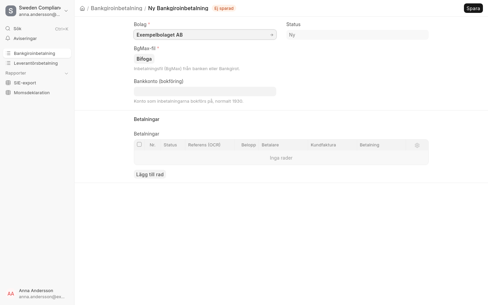
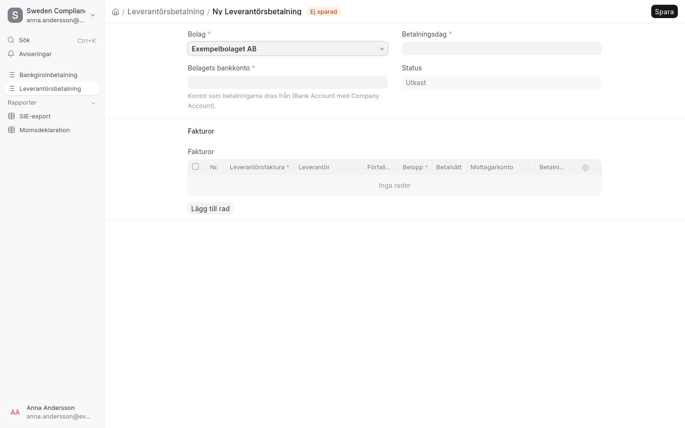

# Betalningar

## Bankgiroinbetalning

Ladda upp inbetalningsfilen från banken eller Bankgirot (BgMax) och klicka **Läs in fil**. Varje betalning
matchas mot en bokförd kundfaktura via OCR-numret och blir en betalning i utkastläge.

- Betalningar som inte matchar listas. Välj kundfaktura på raden och klicka **Skapa betalningar för valda fakturor**.
- **Bokför betalningar** bokför alla utkast.
- Samma betalning kan inte registreras två gånger.

## Leverantörsbetalning

Välj bolagets bankkonto och betalningsdag, klicka **Hämta förfallna fakturor** och sedan **Skapa betalfil**.
Filen (ISO 20022 pain.001) laddas upp i internetbanken. Samtidigt skapas betalningar i utkastläge som bokförs
med **Bokför betalningar** när banken har betalat.

- Leverantörens betalningsuppgifter hämtas från leverantörens bankkonto (bankgiro, plusgiro, kontonummer eller IBAN).
- Leverantörens OCR-nummer skrivs i fältet **OCR / betalningsreferens** på leverantörsfakturan.
- Bara fakturor i SEK.

!!! warning "Prova mot banken först"
    Filformaten följer Bankgirots och bankernas anvisningar men ska provas mot banken innan de används skarpt.
