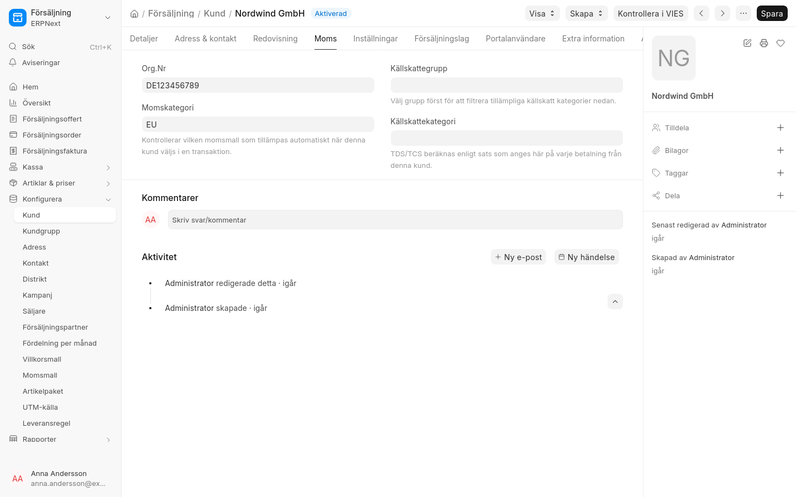
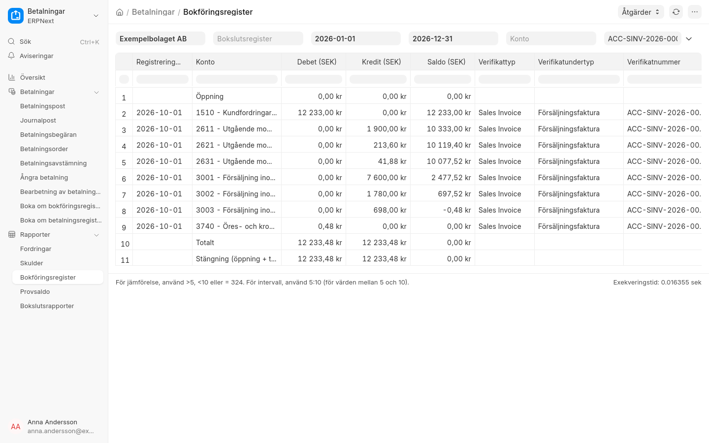
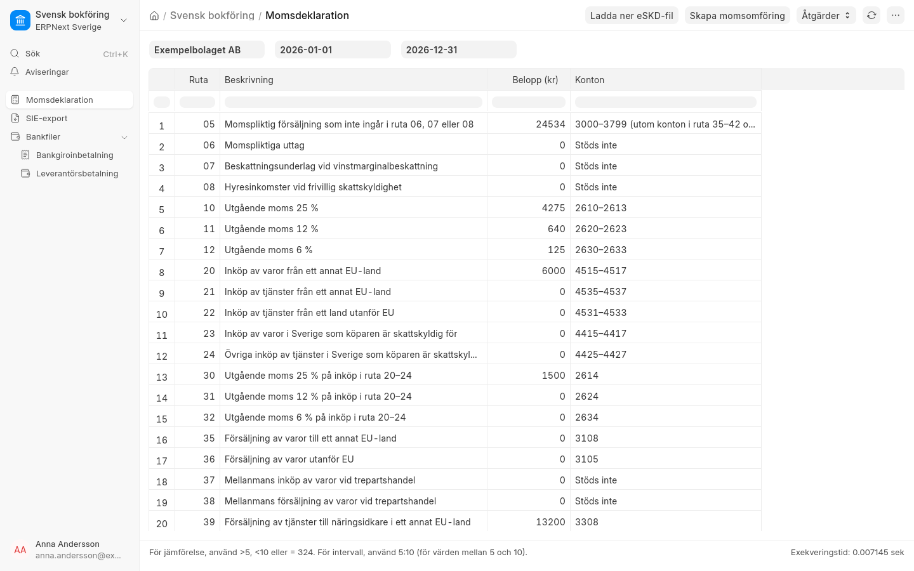
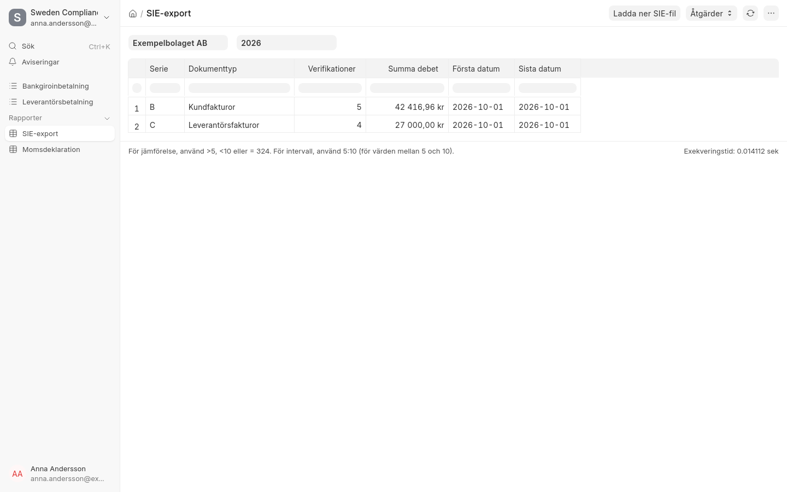

# Bokföring och moms

## Grunduppsättning

ERPNext Sverige sätter upp ett bolag med BAS-kontoplanen för svensk bokföring. Uppsättningen körs en gång per
bolag och går att köra igen utan att något dubbleras:

```bash
bench --site <site> execute erpnext_sverige.setup.company.setup_swedish_company --kwargs "{'company': '<bolag>'}"
```

- Svenskt talformat (1 234,56 kr) och måndag som första veckodag
- Standardkonton på bolaget, till exempel kundfordringar 1510 och leverantörsskulder 2440
- **Immutable Ledger**: verifikationer kan inte ändras i efterhand, bara rättas (bokföringslagen)
- Momsmallar som bokför på rätt BAS-konton (2611/2621/2631/2641)
- Momskategorier med skatteregler för Sverige, EU och länder utanför EU
- Artikelmomsmallar för 12 %, 6 % och momsfritt
- Brevhuvudet **Brevhuvud Sverige** för utskrifter

!!! warning "Kör uppsättningen innan första verifikationen"
    Uppsättningen körs inte automatiskt. Kör den när bolaget har skapats i installationsguiden.

## Momskategori på kunder och leverantörer

Momskategorin (**Svensk moms**, **EU** eller **Utanför EU**) sätts automatiskt utifrån landet i adressen.
Fakturan får rätt moms efter kundens eller leverantörens kategori.

- Privatpersoner i andra EU-länder får svensk moms. Omvänd skattskyldighet gäller bara företag.
- En manuellt vald kategori skrivs inte över, utom när adressens land eller kundtypen ändras.
- Momsregistreringsnumret för EU-företag kontrolleras när kunden sparas. En EU-faktura kan inte bokföras utan det.
- Knappen **Kontrollera i VIES** frågar EU-kommissionens register om numret är giltigt.


*En tysk kund har fått momskategorin EU från adressen.*

## Automatiskt kontoval

Intäkts- och kostnadskonto väljs enligt BAS utifrån fakturans momskategori, artikelns momssats och om artikeln
är en vara eller en tjänst (fältet **Vara eller tjänst (moms)** på artikeln).

| Momskategori | Försäljning | Inköp |
|---|---|---|
| Svensk moms | 3001 (25 %), 3002 (12 %), 3003 (6 %), 3004 (momsfri) | ändras inte |
| EU | 3108 varor, 3308 tjänster | 4515–4517 varor, 4535 tjänster |
| Utanför EU | 3105 varor, 3305 tjänster | 4545 varor, 4531 tjänster |

Ett konto som har valts manuellt utanför tabellen lämnas orört.


*En faktura med 25 %, 12 % och 6 % moms bokförs på 3001, 3002 och 3003.*

## Momsdeklaration

Rapporten **Momsdeklaration** räknar fram Skatteverkets rutor 05–62 och 49 ur huvudboken för vald period.
Beloppen anges i hela kronor.

**Redovisningsperiod:** ange bolagets period under **Redovisningsperiod för moms** på bolaget (Månad, Kvartal eller
År, enligt Skatteverkets beslut). *År* är bolagets räkenskapsår, även om det är brutet. Rapporten öppnas med den
senaste avslutade perioden, till exempel juli–september för den som redovisar per kvartal i oktober.

Rutorna kan visas för vilka datum som helst, men **Ladda ner eSKD-fil**, **Skapa momsomföring** och **Lås
perioden** kräver en hel redovisningsperiod. Annars stoppas de med ett meddelande om rätt datum, eftersom
Skatteverket avvisar en fil för en period som bolaget inte redovisar.

- **Ladda ner eSKD-fil** ger en fil för Skatteverkets e-tjänst "Lämna momsdeklaration". Ladda upp den där,
  kontrollera uppgifterna och signera. Organisationsnumret skrivs som xxxxxx-xxxx, som Skatteverket kräver.
- **Skapa momsomföring** skapar en journalpost som utkast som nollställer momskontona mot 2650. Granska och
  bokför den själv.

Rutorna 06, 07, 08, 37 och 38 stöds inte än och är alltid 0.

!!! warning "Omvänd moms med 12 och 6 %"
    Inköp från EU av varor med 12 eller 6 % moms (till exempel livsmedel och böcker) redovisas än så länge
    med 25 %. Kontrollera rutorna 30–32 om du har sådana inköp.



## SIE-export

Rapporten **SIE-export** sammanställer verifikationerna per serie för valt räkenskapsår. **Ladda ner SIE-fil**
ger en SIE 4-fil till revisor eller bokslutsprogram, med kontoplan, ingående och utgående balanser, resultat,
resultatenheter, projekt och alla verifikationer.


