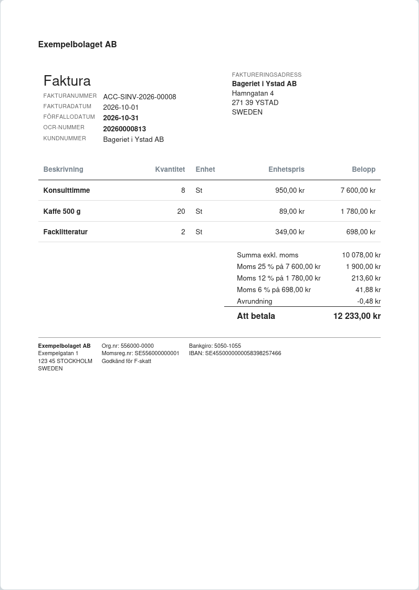
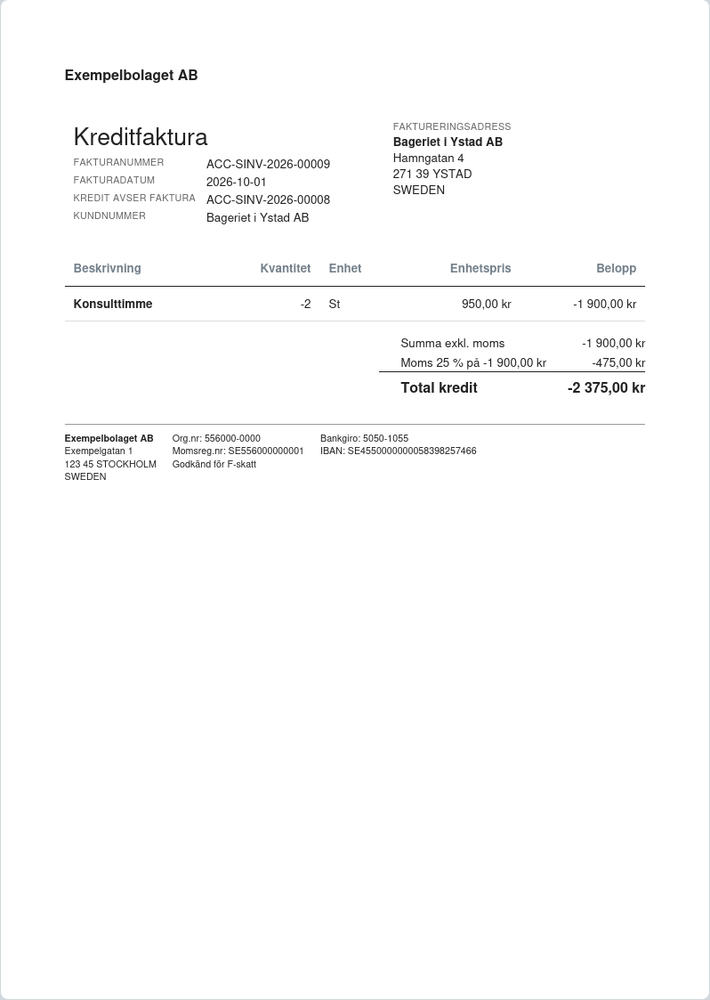

# Fakturering

## Fakturamallen "Faktura Sverige"

Standardmallen för kundfakturor innehåller det som mervärdesskattelagen kräver:

- organisationsnummer (bolagets **Org.Nr**) och momsregistreringsnummer (bolagets **Momsregistreringsnummer**,
  se nedan)
- underlag och moms per momssats, samt kundens momsregistreringsnummer
- hänvisning vid EU-försäljning ("Omvänd skattskyldighet", "Unionsintern leverans") och export
- "Godkänd för F-skatt" om rutan **Godkänd för F-skatt** är ikryssad på bolaget
- bankgiro, plusgiro, kontonummer, IBAN och BIC från bolagets bankkonto
- OCR-nummer om **OCR-nummer på fakturor** är ikryssat på bolaget

Mallen följer kundens språk: svenska, eller engelska för kunder med engelska som språk.

**Momsregistreringsnummer:** fältet på bolaget fylls i som SE + organisationsnummer + 01 när organisationsnumret
anges, och följer med om organisationsnumret ändras. Är bolaget inte momsregistrerat tömmer du fältet; då skrivs
inget momsregistreringsnummer ut. Ett ifyllt nummer måste stämma med organisationsnumret.

*Moms per momssats, OCR-nummer och bolagets uppgifter i sidfoten.*

## Kreditfakturor

En kreditfaktura skrivs ut som **Kreditfaktura** med hänvisning till originalfakturan, utan förfallodatum och
utan OCR-nummer.

!!! tip "PDF"
    För PDF krävs att wkhtmltopdf är installerat, eller att Chrome-generatorn väljs i Utskriftsinställningar.
