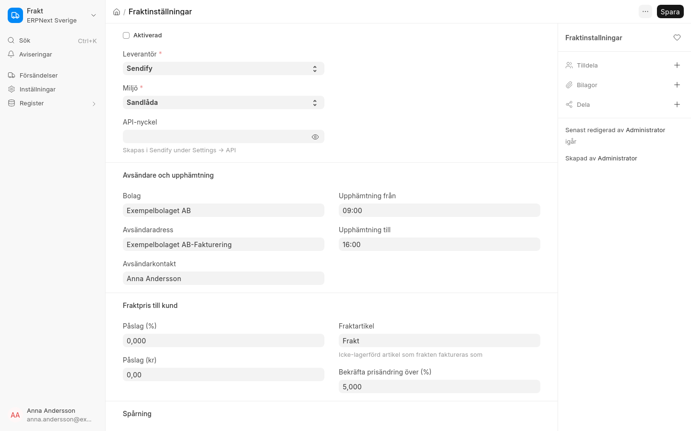

# Frakt via Sendify

ERPNext Sverige Frakt bokar transporter via [Sendify](https://www.sendify.se) och bygger på ERPNext:s
**Försändelse** (Shipment). Allt finns i menyn **Frakt**.

## Inställningar

Inställningarna finns under **Fraktinställningar**.

- **Miljö**: börja med **Sandlåda** för att prova utan riktiga bokningar.
- **API-nyckel**: skapas i Sendify under Settings → API. Nyckeln sparas krypterad.
- **Avsändare och upphämtning**: bolag, avsändaradress, kontaktperson, **Telefon** och **Upphämtningstider**.
  Transportören kräver ett telefonnummer till avsändaren. Det hämtas från kontaktpersonen när fältet är tomt,
  och måste finnas innan frakten kan aktiveras.
- **Fraktpris till kund**: påslag i procent eller kronor, och den artikel (**Frakt**) som frakten faktureras som.

**Upphämtningstider** har en rad per veckodag med upphämtning, med *Från* och *Till*. Har ni kortare dag på
fredagar anger du det på fredagsraden. En dag utan rad har ingen upphämtning; lägg till en rad för lördag om ni
har upphämtning då. Röda dagar i bolagets helglista (till exempel julafton och midsommarafton) har aldrig
upphämtning.

En ny försändelse får nästa dag med upphämtning och den dagens tider. Ändrar du upphämtningsdagen på
försändelsen byts tiderna till den nya dagens. Väljer du en dag utan upphämtning visas ett meddelande, och
försändelsen kan inte bokas förrän du har valt en annan dag.

**Testa anslutning** kontrollerar API-nyckeln och **Hämta transportörsprodukter** fyller registret
Fraktprodukt med en exempelsändning från avsändaren till sig själv. Avsändaradressen måste ha ett riktigt
postnummer, och Sendify godtar inte påhittade. Frakten används först när **Aktiverad** är ikryssad.

## Kollin

På artikeln anges fraktsätt: antingen egna mått (längd, bredd, höjd och eventuellt pallplatser, som räknas om till
flakmeter) eller en förpackningstyp (till exempel EUR-pall) med antal per förpackning. Utifrån det föreslås
kollin på försändelsen.

## Boka

1. På en godkänd följesedel skapar **Skapa → Boka transport** en försändelse med föreslagna kollin, som går att
   ändra. **Föreslå kollin igen** gör ett nytt förslag.
2. **Mottagarens telefon** hämtas från mottagarens kontakt. Transportören kräver numret; fyll i det på
   försändelsen om kontakten saknar det.
3. **Hämta priser** visar alla transportörers priser och kundpris. Välj och **Boka**, eller **Spara val** och boka
   senare. En kund kan ha en förvald fraktprodukt som bokas direkt med **Boka med förval**.
4. Vid bokning beställs alltid upphämtning. Transportör och fraktsedelsnummer skrivs på följesedeln, och
   fraktsedel och etikett sparas som PDF-bilagor på försändelsen (**Hämta fraktsedel** hämtar dem igen).
5. Har priset ändrats mer än **Bekräfta prisändring över (%)** (standard 5 %) sedan valet sparades måste
   ändringen bekräftas. Ett utgånget pris måste hämtas igen.

Avbryts försändelsen i ERPNext avbokas den hos Sendify.

## Spårning

Spårningen hämtas varje timme för bokade försändelser och visas på försändelsen (**Uppdatera spårning**,
**Öppna spårning**). Vid leverans blir försändelsen *Completed*, och avvikelser hos transportören visas.

## Frakt på fakturan

När en kundfaktura skapas från en följesedel med bokad försändelse läggs frakten till som en rad med
fraktartikeln (kundpris = Sendifys pris plus påslag). Raden går att ändra och bokförs på 3520 för svenska kunder.
På offert och försäljningsorder hämtar **Kontrollera fraktpris** priser utan att boka, och **Lägg till frakt**
lägger frakten på ordern, som då inte faktureras igen från försändelsen.

!!! note "Begränsningar"
    I sandlådan fungerar fullständig bokning bara med DHL, UPS och DSV, och spårningen ger bara händelsen
    `ORDERED`. Ombud, tull, egen inlämning och flera Sendify-konton stöds inte än.
