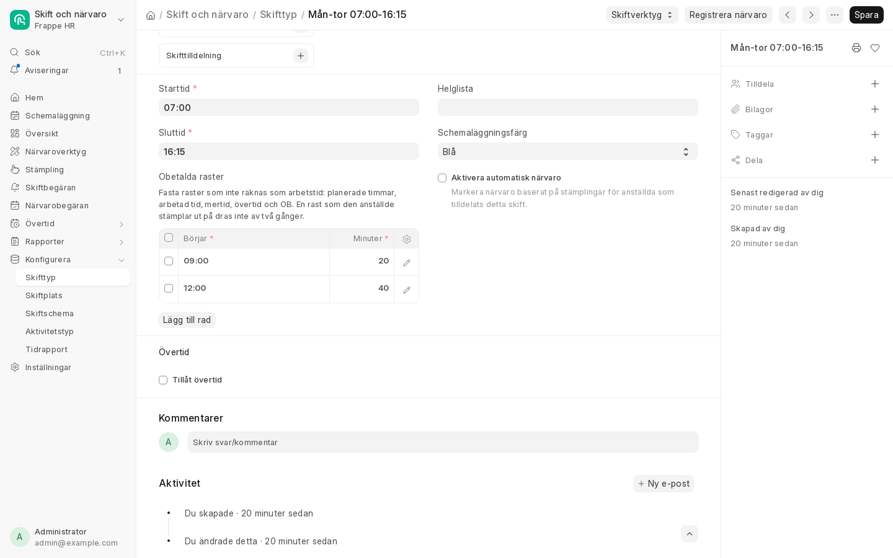
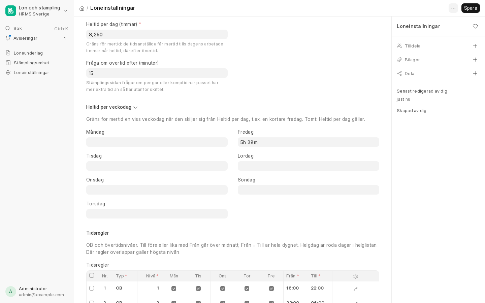

# Skift och arbetstid

Skiften bestämmer den planerade arbetstiden. Den används för frånvaro i timmar, arbetad tid, mertid, övertid
och OB i [löneunderlaget](loneunderlag.md).

## Skifttyp och obetalda raster

En **Skifttyp** har start- och sluttid. Fasta raster som inte är betalda läggs i tabellen **Obetalda raster**,
en rad per rast med klockslaget den börjar och längden i minuter.

Rasterna dras av från:

- de **planerade timmarna**, som styr frånvaro i timmar för timavlönade;
- den **arbetade tiden** (ARB) för timavlönade;
- **mertid, övertid och OB**, så att rasten varken räknas som tid inom skiftet eller ger OB.

Rasterna behöver inte stämplas. Stämplar den anställde ut på rasten dras den inte av två gånger.

*Skifttypen Mån-tor 07:00–16:15 med frukost 09:00 (20 min) och lunch 12:00 (40 min): 8 h 15 min arbetstid.*

## Olika tider olika veckodagar

Ett schema som skiljer sig mellan veckodagarna läggs upp med en skifttyp per sorts dag:

1. Skapa skifttyperna, till exempel *Mån-tor* och *Fredag*.
2. Skapa ett **Skiftschema** för varje skifttyp och välj veckodagarna, till exempel måndag–torsdag och fredag.
3. Tilldela den anställde båda schemana med **Tilldelning av skiftschema**. HRMS skapar då skifttilldelningar
   för rätt dagar.

**Exempel:** 15 minuter längre dagar måndag till torsdag för att sluta tidigare på fredag, och arbetstidskontot
uttaget som kortare fredag:

| Skifttyp | Dagar | Tid | Obetalda raster | Arbetstid |
|---|---|---|---|---|
| Mån-tor | måndag–torsdag | 07:00–16:15 | 09:00 20 min, 12:00 40 min | 8 h 15 min |
| Fredag | fredag | 07:00–12:58 | 09:00 20 min | 5 h 38 min |

Veckan blir 38 h 38 min. Övertid börjar 16:15 måndag–torsdag och 12:58 på fredag.

## Heltid per veckodag

Deltidsanställda får mertid tills dagens arbetade tid når heltid; resten blir övertid. Gränsen ställs in under
**Löneinställningar**:

- **Heltid per dag** gäller alla dagar, i exemplet 8,25 timmar.
- **Heltid per veckodag** används en dag som avviker, i exemplet fredag 5 h 38 min. Tomma dagar följer
  *Heltid per dag*.

## Arbetstidsförkortning (arbetstidskonto)

Teknikavtalets arbetstidskonto kan tas ut på tre sätt:

| Uttag | I ERPNext | I Crona |
|---|---|---|
| **Kortare arbetstid**, varje dag eller en dag i veckan | Bara skiften, som i exemplet ovan. Inget skickas i löneunderlaget. | Ställ in kontot så att det används till förkortningen och inte betalas ut. |
| **Ledighet** | Frånvarotypen **Arbetstidskonto** (PAXml-tidkod ATK). Den kräver ingen tilldelning. | Saldot förs i Crona. Koppla ATK till rätt löneart. |
| **Pengar eller pension** | Ingenting. | Sköts helt i Crona. |

!!! note "Röda dagar"
    En röd dag ger ingen planerad tid. Faller den i en vecka med inarbetad tid, till exempel en fredag, och tiden
    ska tas ut en annan dag, ändras skiftet för de dagarna med en egen **Skifttilldelning**. Hur det ska vara står
    ofta i det lokala avtalet.
