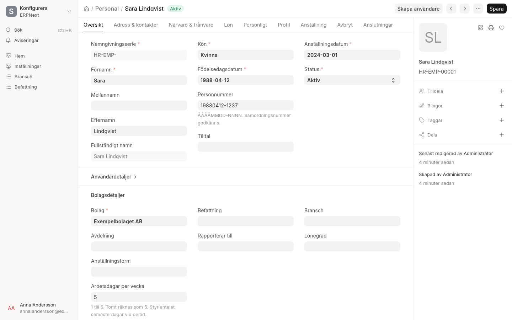
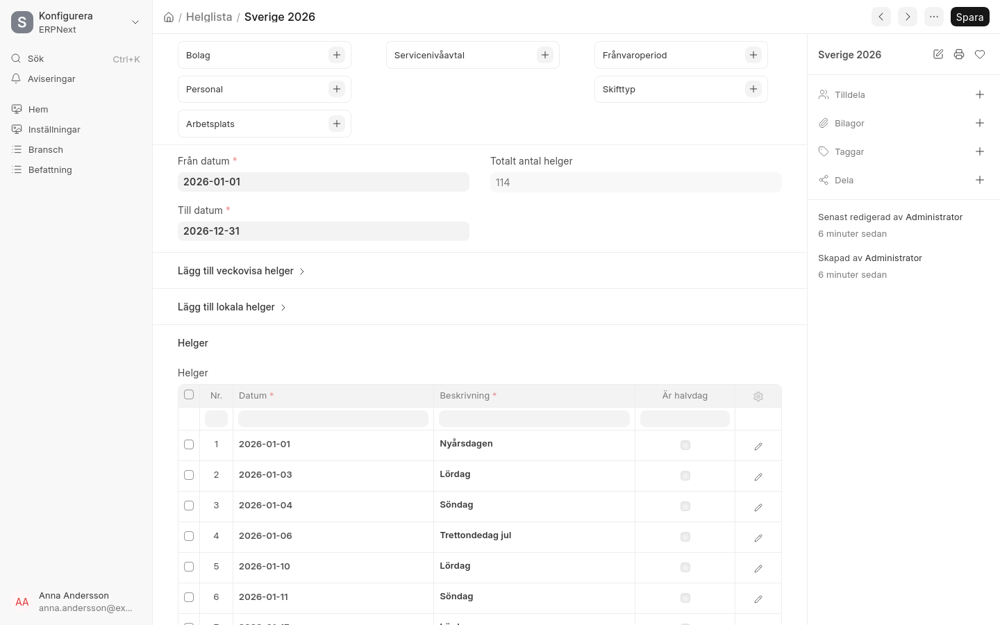
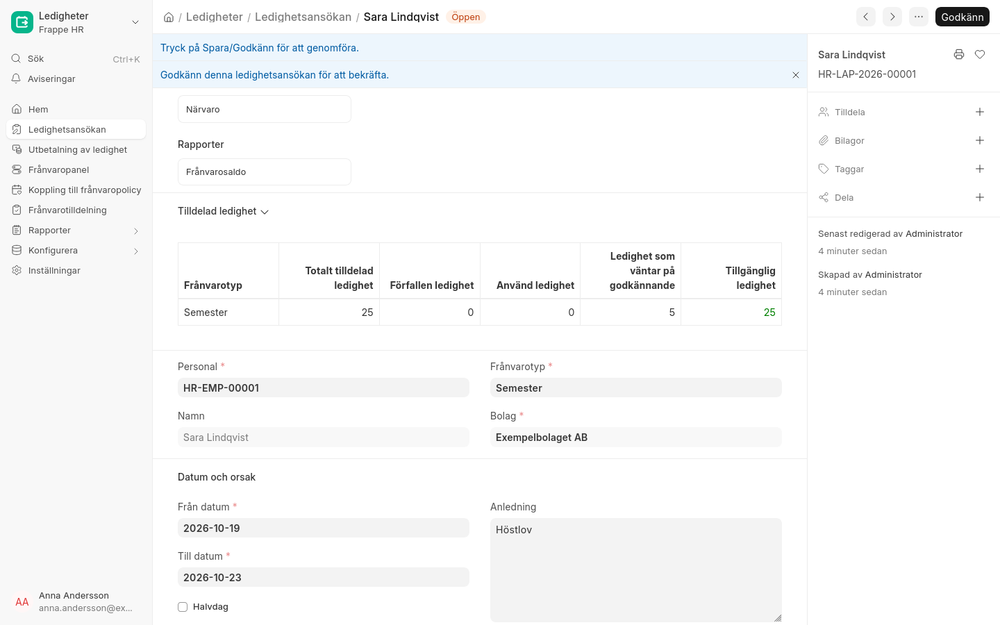

# Personal

## Anställda och personnummer

Den anställde har fälten **Personnummer**, **Arbetsdagar per vecka** och **Sysselsättningsgrad**.

- Personnummer kan bara läsas av rollerna HR Manager och HR User, måste vara unikt och sparas inte i
  ändringshistoriken. Samordningsnummer godkänns.
- Arbetsdagar per vecka styr antalet semesterdagar vid deltid.

## Helgdagslistor

Helgdagslistan **Sverige ÅÅÅÅ** innehåller röda dagar samt midsommar-, jul- och nyårsafton, och kopplas till
företaget från 1 januari. Nästa års lista skapas under [Årsrutiner](../arsrutiner.md).

## Semester och frånvaro

Frånvarotyperna är Semester, Sjukfrånvaro, VAB, Föräldraledighet, Tjänstledighet och Kompledighet.

- Semester: 25 dagar per år. Högst 5 dagar per år får sparas, och de förfaller efter 5 år.
- Vid deltid blir semestern 25 × arbetsdagar per vecka / 5, avrundat uppåt.

*Ansökan visar tilldelade, använda och tillgängliga dagar.*
